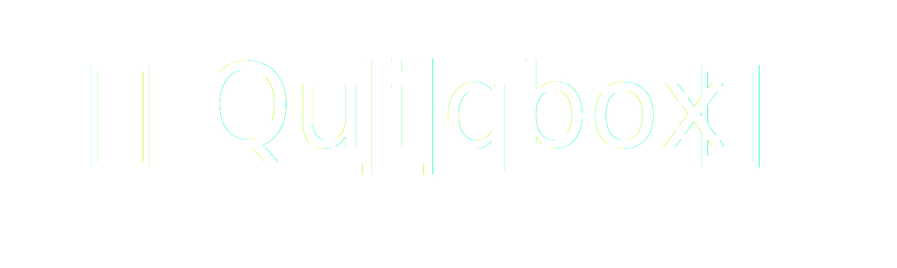

<p align="center">
  
</p>

**Quiqbox** is a quantum chemistry and quantum computing software package that starts off around Gaussian basis set optimization of molecular electronic-structure problems. Quiqbox is written in pure [Julia](https://julialang.org/).

| Documentation | License | Code Status |
| :--- | :---: | ---: |
| [![][Doc-s-img]][Doc-stable] <br /> [![][Doc-l-img]][Doc-latest] | [![License: MIT][License-img]][License-url] | [![CI][GA-CI-img]][GA-CI-url] <br /> [![codecov][codecov-img]][codecov-url] |

<br />

# Features

* Floating and fixed-basis Gaussian-type orbital (GTO) configurations.
* Symbolic representation and analysis of basis function parameters.
* Standalone 1-electron and 2-electron integral functions (powered by [libcint_jll](https://github.com/JuliaBinaryWrappers/libcint_jll.jl)).
* Restricted (closed-shell) and unrestricted (open-shell) Hartree–Fock methods (RHF & UHF).
* Molecular orbital data output in [Molden](https://www3.cmbi.umcn.nl/molden/) file format.
* Variational optimization of orbital geometry based on automatic differentiation (AD).

# Setup

## Supported system platforms (64-bit)
* Linux
* Mac OS
* [Windows Subsystem for Linux](https://docs.microsoft.com/en-us/windows/wsl/about)

## Julia Environment
* [1.5+](https://github.com/frankwswang/Quiqbox.jl/actions/workflows/CI.yml)

## Installation in Julia [REPL](https://docs.julialang.org/en/v1/manual/getting-started/)

Type `]` to enter the [`Pkg` mode](https://docs.julialang.org/en/v1/stdlib/REPL/#Pkg-mode):

```julia
(@v1.x) pkg>
```

Type `add Quiqbox` and hit *Enter* key to install Quiqbox:

```julia
(@v1.x) pkg> add Quiqbox
```

After the installation completes, hit *Backspace* key to go back to Julia REPL and use [`using`](https://docs.julialang.org/en/v1/base/base/#using) to load Quiqbox:

```julia
julia> using Quiqbox
```

# Use cases

## Apply existed basis sets
```julia
coords = [[-0.7,0,0], [0.7,0,0]]

bsH2O = genBasisFunc.(coords, "STO-3G") |> flatten
```

## Build your own basis sets
```julia
bs = genBasisFunc.(coords, fill(GaussFunc(1, 0.75), 2))
```

## Run Hartree-Fock method
```julia
nuc = ["H", "H"]

runHF(bs, nuc, coords)
```

## Optimize the basis set
```
pars = uniqueParams!(bs, filterMapping=true)

optimizeParams!(bs, pars[1:4], nuc, coords)
```

For more basic usage of the programming language behind Quiqbox, Julia, please refer to [the official documentation](https://docs.julialang.org/) or [one official tutorial](https://juliaacademy.com/p/intro-to-julia).


[Doc-stable]:  https://github.com/frankwswang/Quiqbox.jl/stable
[Doc-latest]:  https://github.com/frankwswang/Quiqbox.jl/latest
[Doc-s-img]:   https://img.shields.io/badge/docs-stable-blue.svg
[Doc-l-img]:   https://img.shields.io/badge/docs-latest-blue.svg
[GA-CI-img]:   https://github.com/frankwswang/Quiqbox.jl/actions/workflows/CI.yml/badge.svg?branch=main
[GA-CI-url]:   https://github.com/frankwswang/Quiqbox.jl/actions/workflows/CI.yml
[codecov-img]: https://codecov.io/gh/frankwswang/Quiqbox.jl/branch/main/graph/badge.svg?token=Z1XOA39DV2
[codecov-url]: https://codecov.io/gh/frankwswang/Quiqbox.jl
[License-img]: https://img.shields.io/badge/License-MIT-blueviolet.svg
[License-url]: https://opensource.org/licenses/MIT