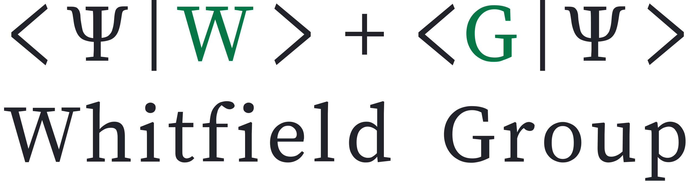

<p align="center">
    <a href="https://frankwswang.github.io/Quiqbox.jl/stable/">
        
    </a>
</p>

**Quiqbox** is a quantum chemistry and quantum physics software package that starts around Gaussian basis set optimization for electronic structure problems. Quiqbox is written in pure [Julia](https://julialang.org/). This work was supported by the U.S. DOE Grant DE-SC0019374 and the ARO Grant W911NF2410043.

| Documentation | Code Identifier | Paper | License |
| :---: | :---: | :---: | :---: |
| [![][Doc-l-img]][Doc-latest] | [![][Zenodo-DOI-img]][Zenodo-DOI-url] |[![][arXiv-img]][arXiv-url] | [![License: MIT][License-img]][License-url] |

| Development Status |
|:---:|
|[![][New-commits-img]][New-commits-url] [![codecov][codecov-img]][codecov-url] [![CI][GA-CI-img]][GA-CI-url] [![AquaQA][Aqua-img]][Aqua-url] |

<br />

# Features

* Support constructing floating and fixed-position contracted orbitals.
* Support constructing mixed-contracted Gaussian-type orbitals and building hybrid basis sets.
* Provide native one-electron and two-electron integral functions.
* Provide restricted (closed-shell) and unrestricted (open-shell) Hartree–Fock methods (RHF & UHF).
* Provide dynamic computation-graph based function generation and variational optimization.

# Setup

## OS and hardware platform support

* Windows (x86-64)
* Generic Linux (x86-64)
* macOS (x86-64 and Apple silicon)

## Julia (64-bit) compatibility

Currently, Quiqbox tries to support the [latest stable release](https://julialang.org/downloads/#current_stable_release) of 64-bit Julia as soon as possible. Backward compatibility with previous versions is not guaranteed but can be checked [here](https://github.com/frankwswang/Quiqbox.jl/actions/workflows/CI-Backward.yml).

## Installation in Julia [REPL](https://docs.julialang.org/en/v1/stdlib/REPL/)

Type `]` in the default [Julian mode](https://docs.julialang.org/en/v1/stdlib/REPL/#The-Julian-mode) to switch to the [Pkg mode](https://docs.julialang.org/en/v1/stdlib/REPL/#Pkg-mode):

```julia
(@v1.x) pkg>
```

Type the following command and hit *Enter* key to install Quiqbox:

```julia
(@v1.x) pkg> add Quiqbox
```

After the installation completes, hit the *Backspace* key to go back to the Julian mode and use [`using`](https://docs.julialang.org/en/v1/base/base/#using) to load Quiqbox:

```julia
julia> using Quiqbox
```

# Documentation

Objects defined by Quiqbox that are directly exported to the user have the corresponding docstring, which can be accessed through the [Help mode](https://docs.julialang.org/en/v1/stdlib/REPL/#Help-mode) in Julia REPL. The [latest release's documentation][Doc-latest] contains all the docstrings and additional tutorials of the package. For unreleased/experimental features, please refer to the [developer documentation][Doc-dev].

# Citation

If you use Quiqbox in your research, please cite the following paper:

- [Wang, W., & Whitfield, J. D. (2023). Basis set generation and optimization in the NISQ era with Quiqbox.jl. *Journal of Chemical Theory and Computation, 19*(22), 8032-8052.][JCTC-url]

<br />
<br />

<p align="center">
    <a href="https://jdwhitfield.com/">
        
    </a>
</p>

<br />

[Doc-l-img]:   https://img.shields.io/github/v/release/frankwswang/Quiqbox.jl?label=latest%20release&color=seagreen
[Doc-latest]:  https://frankwswang.github.io/Quiqbox.jl/stable
[Doc-dev]:  https://frankwswang.github.io/Quiqbox.jl/dev

[GA-CI-img]:   https://github.com/frankwswang/Quiqbox.jl/actions/workflows/CI-Release.yml/badge.svg
[GA-CI-url]:   https://github.com/frankwswang/Quiqbox.jl/actions/workflows/CI-Release.yml

[codecov-img]: https://codecov.io/gh/frankwswang/Quiqbox.jl/branch/main/graph/badge.svg?token=Z1XOA39DV2
[codecov-url]: https://codecov.io/gh/frankwswang/Quiqbox.jl

[New-commits-img]: https://img.shields.io/github/commits-since/frankwswang/Quiqbox.jl/latest?color=teal&include_prereleases
[New-commits-url]: https://github.com/frankwswang/Quiqbox.jl/commits/main

[Zenodo-DOI-img]: https://zenodo.org/badge/DOI/10.5281/zenodo.7448313.svg
[Zenodo-DOI-url]: https://doi.org/10.5281/zenodo.7448313

[arXiv-img]: https://img.shields.io/badge/arXiv-2212.04586-b31b1b.svg
[arXiv-url]: https://arxiv.org/abs/2212.04586
[JCTC-url]: https://pubs.acs.org/doi/10.1021/acs.jctc.3c00011

[License-img]: https://img.shields.io/badge/License-MIT-yellow.svg
[License-url]: https://github.com/frankwswang/Quiqbox.jl/blob/main/LICENSE

[Aqua-img]: https://raw.githubusercontent.com/JuliaTesting/Aqua.jl/master/badge.svg
[Aqua-url]: https://github.com/JuliaTesting/Aqua.jl